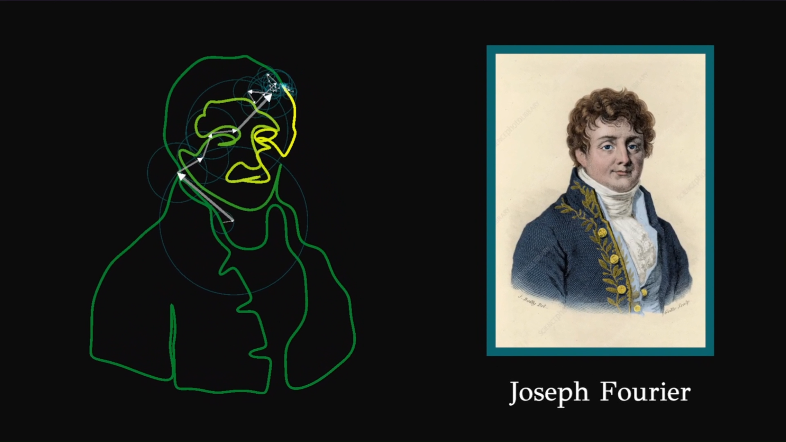
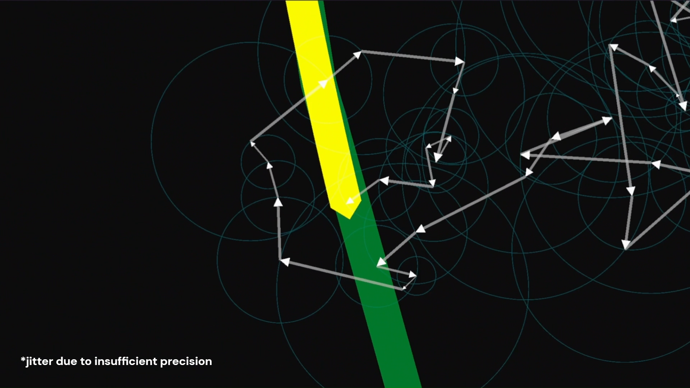
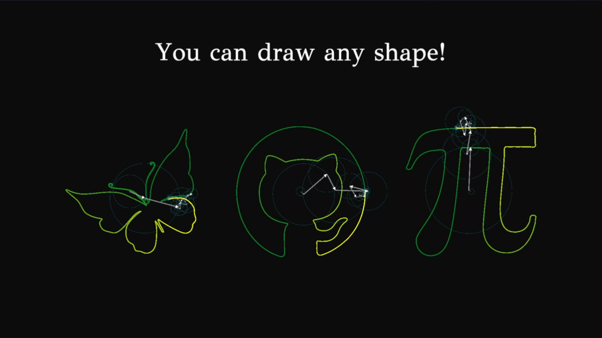
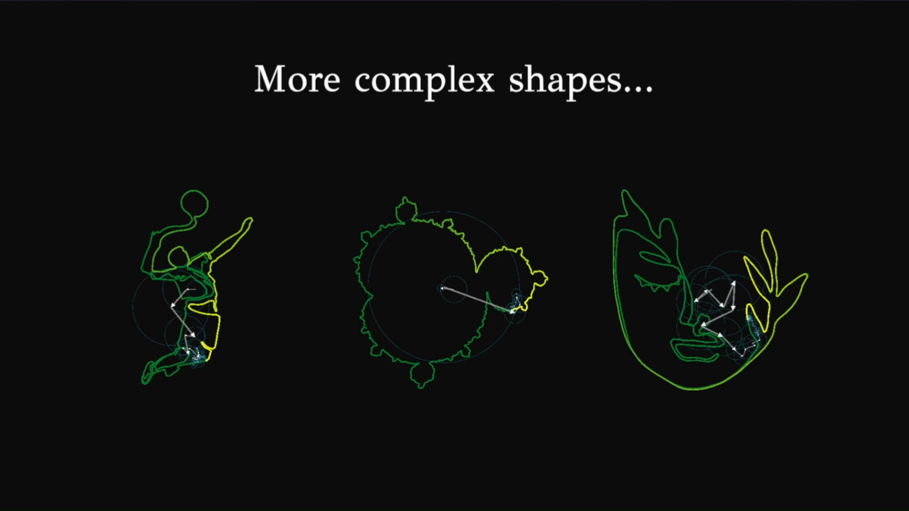
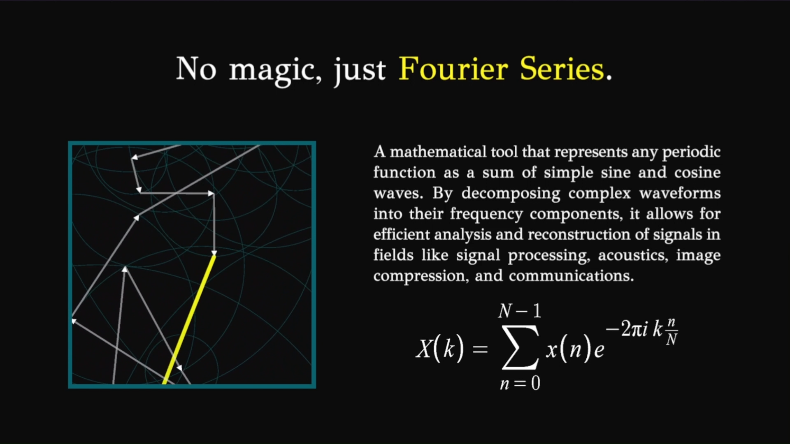

# Fourier Series Animation

This Unity project animates rotating vectors (epicycles) to visualize how Fourier series can approximate complex shapes. It illustrates the breakdown of periodic signals into sums of circular motions with different frequencies and amplitudes.

The repository contains the raw Unity project files without additional explanation. To understand the purpose and see the animation in action, please view the demonstration and description in my [**LinkedIn Post**](https://www.linkedin.com/posts/anar-bastanov_recreationalcoding-fourierseries-signalprocessing-activity-7345810006753091584-Tq3c).

## Preview

Open to view screenshots from the animation

---

---

---

---

---

---

## License

Copyright &copy; 2025 Anar Bastanov  
Distributed under the [MIT License](http://www.opensource.org/licenses/mit-license.php).
